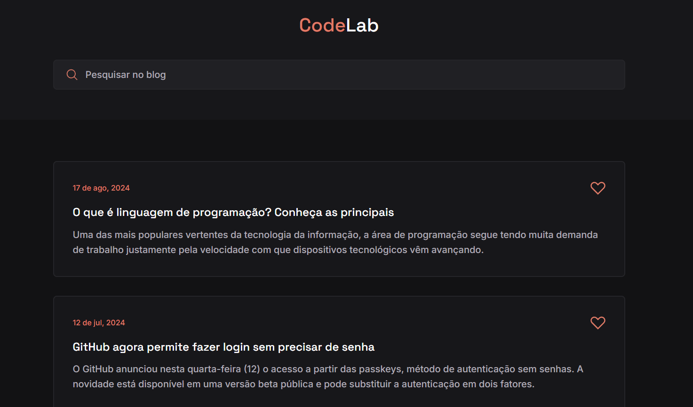

<h1 align="center">
  💻 Blog
</h1>

  

<h4 align="center"><a href="https://blog-codelab.netlify.app/">Clique para visitar o projeto</a></h4>

## 📚 Sobre o projeto

Essa é a minha resolução do desafio 01 da comunidade CodeLab. O projeto se trata de um blog com notícias sobre tecnologias. 🚀

## 🧑🏽‍💻 Funcionalidades

☑️ Visualizar um layout adequado ao seu dispositivo. 
☑️ Marcar notícia como favorita.

## 🛠️ Tecnologias utilizadas

- HTML
- CSS
- JavaScript
- Scroll Reveal
