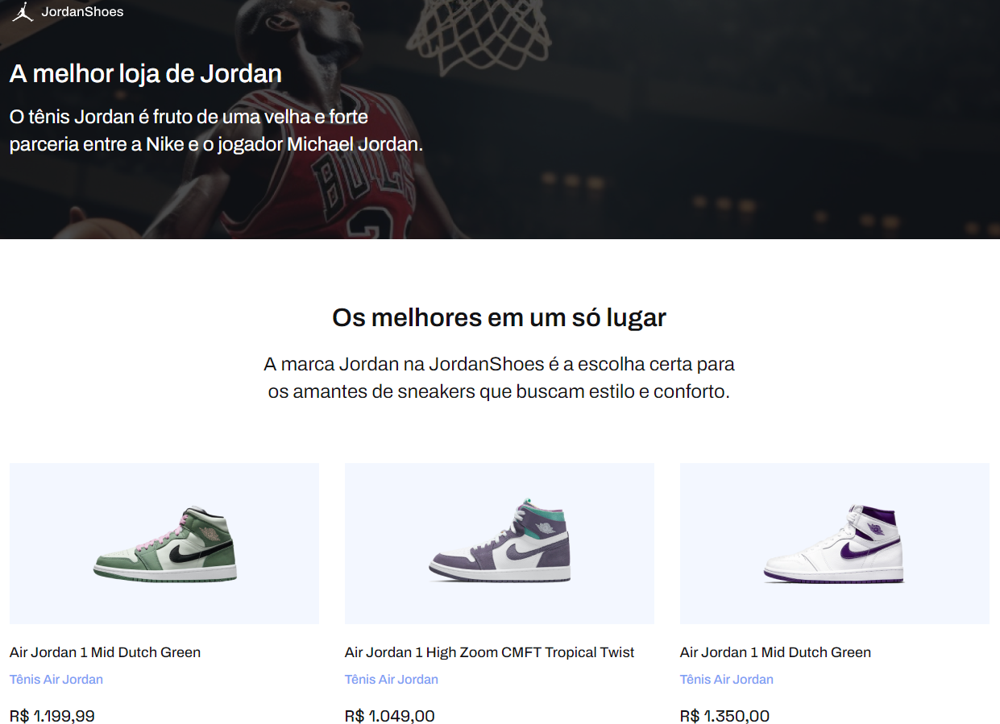

<h1 align="center">
  🏀 JordanShoes
</h1>

  

<h4 align="center"><a href="https://jordanshoes-store.netlify.app/">Clique para visitar o projeto</a></h4>

## 📚 Sobre o projeto

Essa é a minha resolução do desafio 02 da comunidade CodeLab. O projeto se refere a uma loja de venda de tênis da marca Jordan. 🚀

## 🧑🏽‍💻 Funcionalidades

☑️ Visualizar um layout adequado ao seu dispositivo. 

## 🛠️ Tecnologias utilizadas

- HTML
- CSS
