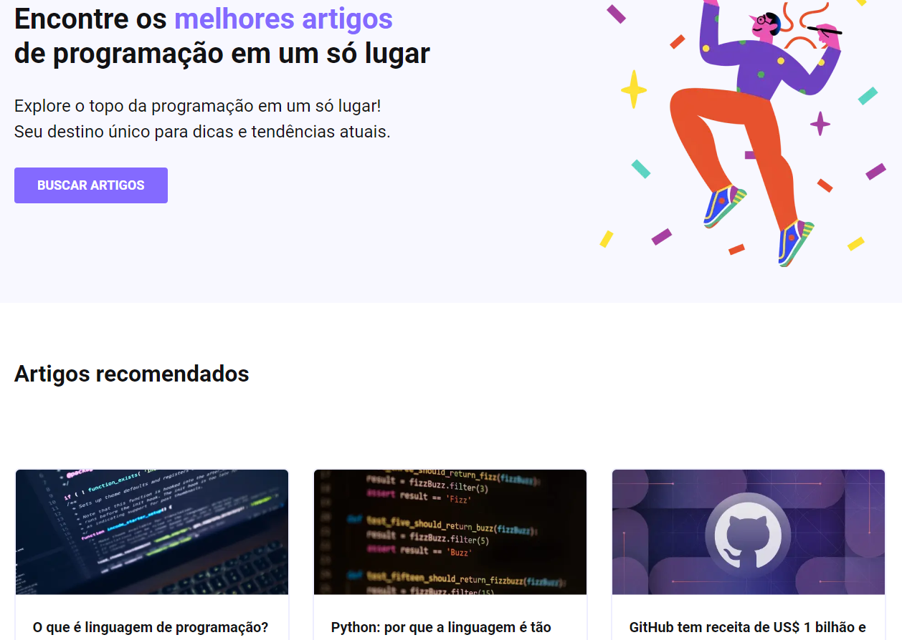

<h1 align="center">
  💻 TechBlog
</h1>

  

<h4 align="center"><a href="https://tech-blog-psi-nine.vercel.app/">Clique para visitar o projeto</a></h4>

## 📚 Sobre o projeto

Essa é a minha resolução do desafio 03 da comunidade CodeLab. O projeto se refere a uma landing page com artigos sobre tecnologia. 🚀

## 🧑🏽‍💻 Interações | Funcionalidades

☑️ Visualizar um layout adequado ao seu dispositivo. 

## 🛠️ Tecnologias utilizadas

- ReactJS
