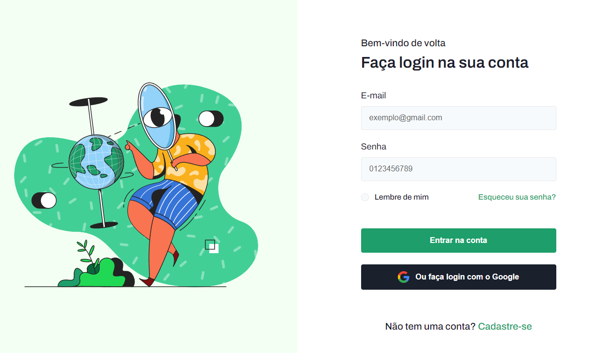

<h1 align="center">
  🔑 Login
</h1>

  

<h4 align="center"><a href="https://login-drab-ten.vercel.app/">Clique para visitar o projeto</a></h4>

## 📚 Sobre o projeto

Essa é a minha resolução do desafio 04 da comunidade CodeLab. O projeto se refere a uma tela de login. 🚀

## 🧑🏽‍💻 Funcionalidades

☑️ Visualizar um layout adequado ao seu dispositivo. 
☑️ Estado de hover nos botões. 

## 🛠️ Tecnologias utilizadas

- ReactJS
