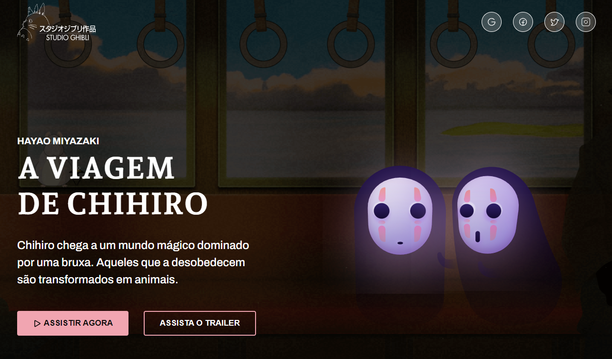

<h1 align="center">
  🎥 Studio Ghibli
</h1>

  

<h4 align="center"><a href="https://studio-ghibli-4568bb.netlify.app/">Clique para visitar o projeto</a></h4>

## 📚 Sobre o projeto

Essa é a minha resolução do desafio 05 da comunidade CodeLab. O projeto se refere a uma pequena apresentação do filme A Viagem de Chihiro. 🚀

## 🧑🏽‍💻 Interações | Funcionalidades

☑️ Visualizar um layout adequado ao seu dispositivo. 
☑️ Estado de hover nos botões. 

## 🛠️ Tecnologias utilizadas

- React
