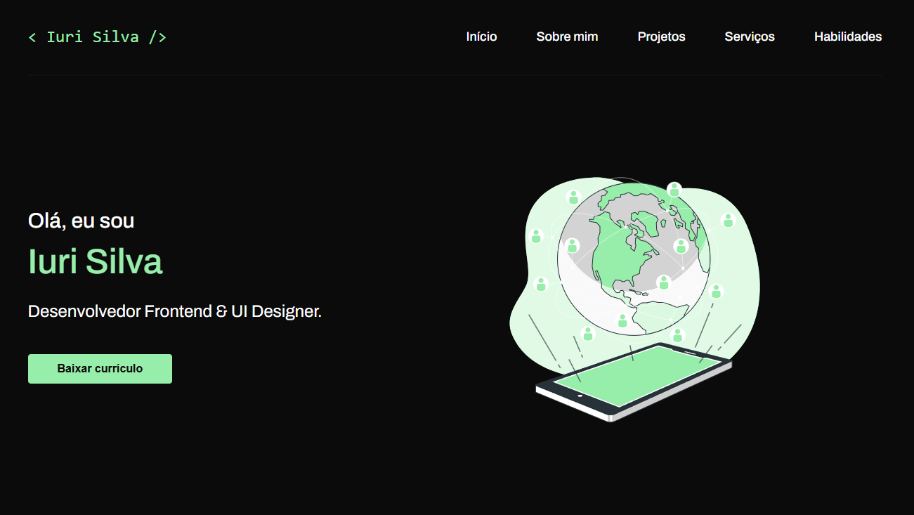

<h1 align="center">
  💻 Mefolio
</h1>

  

<h4 align="center"><a href="https://mefolio-478fde.netlify.app/">Clique para visitar o projeto</a></h4>

## 📚 Sobre o projeto

Essa é a minha resolução do desafio 06 da comunidade CodeLab. O projeto se refere a uma landing page de um portifólio com base nas informações do professor IuriCode. 🚀

## 🧑🏽‍💻 Funcionalidades

☑️ Visualizar um layout adequado ao seu dispositivo.  
☑️ Estado de hover nos links e botões.

## 🛠️ Tecnologias utilizadas

- ReactJS
