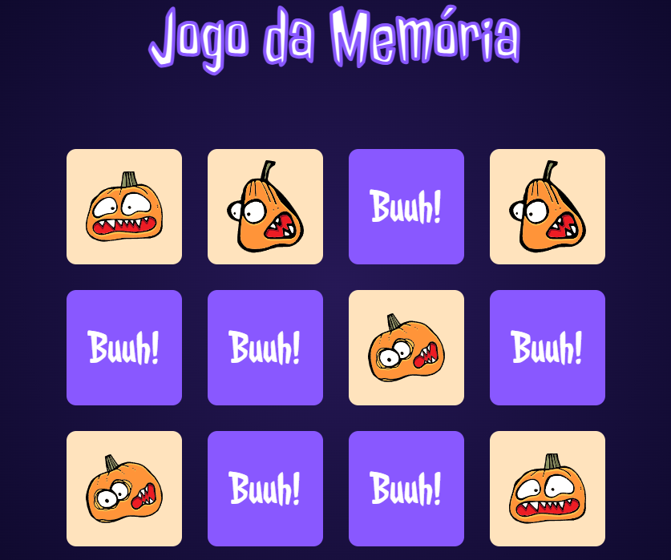

<h1 align="center">
  🎃 Memoween
</h1>

  

<h4 align="center"><a href="https://memoween-game.netlify.app/">Clique para visitar o projeto</a></h4>

## 📚 Sobre o projeto

Essa é a minha resolução do desafio 07 da comunidade CodeLab. O projeto se trata de um jogo da memória com o tema de Halloween, onde o usuário pode escolher entre três níveis para jogar. 🚀

## 🧑🏽‍💻 Interações | Funcionalidades

☑️ Visualizar um layout adequado ao seu dispositivo. 
☑️ Estado de hover nos links e botões.
☑️ Manter as cartas viradas caso forme o par.
☑️ Exibir modal com mensagem de jogo concluído ao completar as cartas.
☑️ Escolher entre jogar novamente ou mudar a dificuldade do jogo.

## 🛠️ Tecnologias utilizadas

- ReactJS
- TypeScript
- Styled Components
