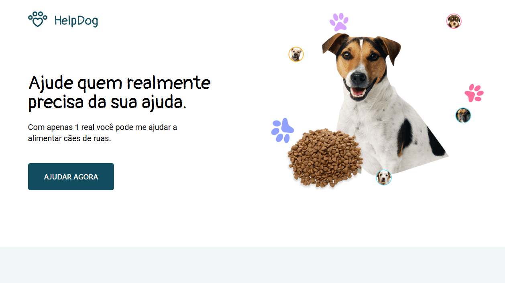

<h1 align="center">
  🶠HelpDog
</h1>

  

<h4 align="center"><a href="https://help-dog-b14c69.netlify.app/">Clique para visitar o projeto</a></h4>

## 📚 Sobre o projeto

Essa é a minha resolução do desafio 09 da comunidade CodeLab. O projeto se trata de uma pequena landing page para doações de alimentos para cães de rua. 🚀

## 🧑🏽‍💻 Funcionalidades

☑️ Visualizar um layout adequado ao seu dispositivo. 

## 🛠️ Tecnologias utilizadas

- ReactJS
- TypeScript
- Tailwind CSS
