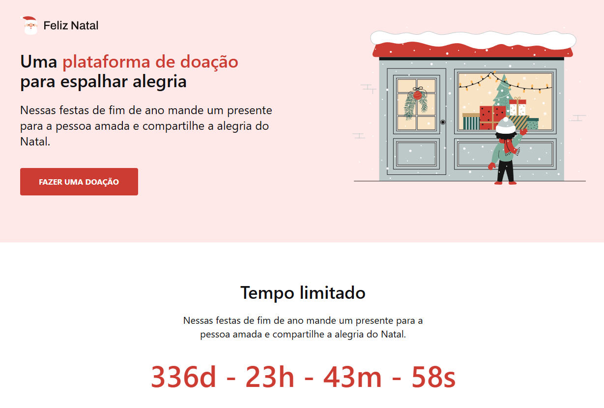

<h1 align="center">
  🎅🏻 Feliz Natal
</h1>

  

<h4 align="center"><a href="https://feliz-natal-6fd203.netlify.app/">Clique para visitar o projeto</a></h4>

## 📚 Sobre o projeto

Essa é a minha resolução do desafio 10 da comunidade CodeLab. O projeto se trata de uma pequena landing page focada em doações de natal. 🚀

## 🧑🏽‍💻 Interações | Funcionalidades

☑️ Visualizar um layout adequado ao seu dispositivo. 
☑️ Estado de hover nos botões. 
☑️ Exibir os dias restantes para o natal em tempo real. 

## 🛠️ Tecnologias utilizadas

- ReactJS
- TypeScript
- Tailwind CSS
